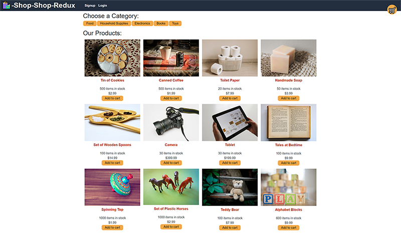

# **Shop-Shop Redux**   
## **In this weekly challenge, we were tasked with converting an existing e-commerce application from using React state to Redux for state management. I utilized React, Redux, GraphQL, Apollo Server, MongoDB and Mongoose for creating this application.**

## **Table of Contents**

* [Deployed Application](#deployed-application)

* [Screenshot](#screenshot)

* [Features](#features)

* [Usage](#usage)

* [License](#license)

* [Badges](#badges)

* [Technology](#technology)

* [Contact](#contact-information)

## **Deployed Application**
Github 
https://github.com/mwpx777/shop-shop-redux

Heroku
https://dashboard.heroku.com/apps/shop-shop-redux-mwp

Deployed Application
https://shop-shop-redux-mwp.herokuapp.com/

## **Screenshot**

## **Features**
This project features React, Redux, Node.js, Express.js, GraphQL, Apollo Server, MongoDB and Mongoose.

## **Usage**
This e-commerce app can be utilized by a user that would like purchase items from an online retailer.

## **License**
(https://opensource.org/licenses/MIT)

## **Badges**

## **Technology**
Javascript, React, Redux, Node.js, GraphQL, Apollo Server, MongoDB, Mongoose.

## **Contact Information**
##### For questions or comments, please contact

* Github: (https://github.com/mwpx777)

* LinkedIn: (https://www.linkedin.com/in/mwpdesigns/)

* Email: (mwpx777@gmail.com)

